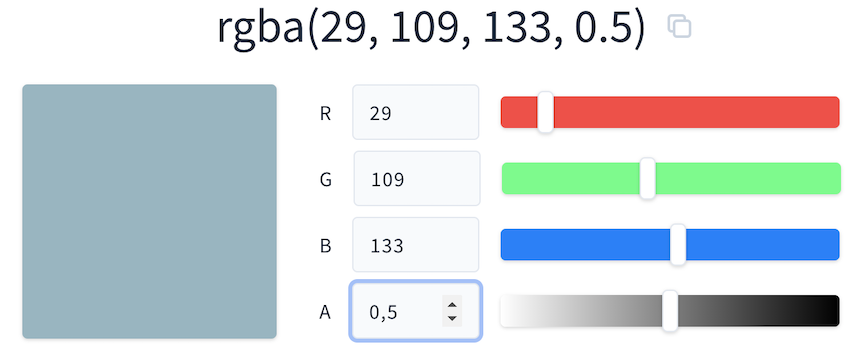
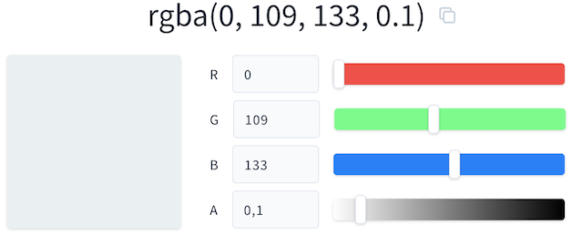
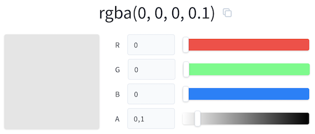
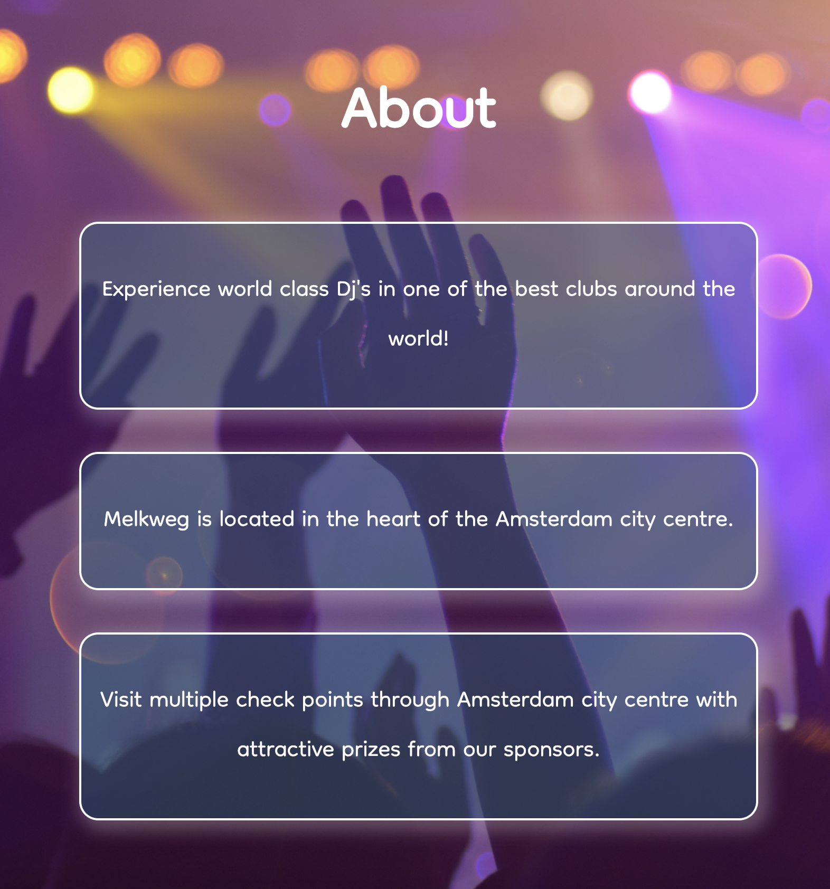

# Dream Day Festival
Dream day festival is electronic music event held in Amsterdam, Netherlands. It's a place for people to relax, experince world class electronic music performers, meet new people and enjoy and soak the great Amsterdam vibe. Located in one of the best venues in Amsterdam, the home of the Dream Day Festival is Melkweg.

This site gives visitors and users basic and important information about the event, location, line up, tickets and contact in case of questions. 

# Table of Contents 
* [UX]("UX")
    * [User Goals](#user-goals "User Goals")
    * [User Stories](#user-stories "User Stories")
    * [Site Owners Goals](#site-owners-goals)
    * [User Requirements and Expectations](#user-requirements-and-expectations)
         * [Requirements](#requirements)
         * [Expectations](#expectations)
    * [Design Choices](#design-choices)
         * [Fonts](#fonts)
         * [Icons](#icons)
         * [Colours](#colours)
         * [Structure](#structure)
# UX

## User Goals

- Visually appealing and easy to use
- All content is quickly accesible 
- Important information provided
- Links to social media
- Direct contact form

## User Story

- As a user, I want to know what artist are performing
- As a user, I want to know the location of the event
- As a user, I would like to know ticket price
- As a user, I want to be able to easily contact the organizers
- As a user, I would like to have multiple social media links options
- As a user, I want website to be easy usable 

## Site Owners Goals

- Providing information to visitors 
- Promote artists 
- Getting new fan base through social media platforms

### Requirements

- Easy to navigate on various screen sizes.
- Clear and important information provided
- Introduce the vibe of a festival through full background images
- Contact form and social media links
- Minimalistic design for smooth overall experience

### Expectations

- I expect to know if a form has been submitted properly
- I expect all links to open in new tab and work properly
- I expect links on artist's websites
- I expect screen size not to affect the quality of the website.
- I expect all information to be correct and accurate.

## Design Choices

### Fonts
When choosing fonts for the page, I stopped at [Google Fonts](https://fonts.google.com/ "Google fonts"). After a short search, I came across a font named 'Dongle'. I liked this font because of its shape and there is no extra sharp edges. The main purpose of the site is to make easy going experience with the user, so I choose this style of font. Same font style is also aplied in contact form, so the original font from contact form doesn't stand out too much. In case of fallback, I included CSS generic font family "sans-serif". 

### Icons
Here I used 4 icons for the "social-media" part. I choose background image as icon on a link, so user can clik on desired icon and visit homepage of choosen social media platform. I got icons at [Font Awesome](https://fontawesome.com/ "Font Awesome"). After choosing icons, I then styled them in style.css file for better page position and look.

### Colours 
I have used [RGBA Color Picker](https://rgbacolorpicker.com/ "RGBA Colorpicker") for picking colors. I have used variables for colors, because in case of changing mind about colors, I can only change variable tag and not every element that was styled with this color. There are three main colors. Because of very colorful background images, I have used RGBA function with opacity. Primary and overlay colors were mostly used in hamburger menu styling. Box color was used on page box elements. Below are color codes and pictures for better presentation.

+ RGBA values for primary color.
\
&nbsp;
    

+ RGBA values for overlay color.
\
&nbsp;
    

+ RGBA values for box color.
\
&nbsp;
    

 * RGB 29, 109, 133, - This colour will be used as a primary color with opacity of 0.5
 * RGB 0, 109, 133, - This colour will be used as overlay color with opacity of 1.
 * RGB 0, 0, 0, - This colour will be used on the line up section as backround. 
 * #fff - This colour will be used as a text color in contact form. 

 ### Structure
 I will be building my website with a mobile first mindset using the 320px as the smallest screen size for styling to look good. Mobile first aproach is also used, as its expected that most users will visit the site through mobile device. I used this breakpoints, as they seem to be standard. 

 | Screen Size | Breakpoint |
| ----------- | ---------- |
| x-small     | <576px     |
| small       | => 576px   |
| medium      | => 768px   |
| large       | => 992px   |
| x-large     | => 1200px  |

\
&nbsp;
[Back to Top](#table-of-contents)
\
&nbsp;

# Wireframes
I have used [Balsamic](https://balsamiq.com/wireframes/ "Balsamic") to develop my wireframe for the website. I first created the desktop version, just to have an idea in which direction the site would go.  When creating website, I then started with mobile first, and then adjusting to larger screens. Keeping a simple user friendly experince, a one-page website is used. This gets the user through the content and quickly to the contact form and details via scrolling or directly via the navigation bar.

The wireframe is below:

### [Desktop Wireframe](wireframes/dream-day-basic.png "Desktop wireframe")

### [Tablet Wireframe](wireframes/dream-day-tablet.png "Tablet wireframe")

### [Mobile Wireframe](wireframes/dream-day-mobile.png "Mobile wireframe")

\
&nbsp;
[Back to Top](#table-of-contents)
\
&nbsp;

# Features

## Existing Features

### Navigation Bar

The hamburger navigation bar is fixed in all screen sizes and thats why it doesnt brake anything through the page. It includes links to manover around the site easily. Using javascript I could make menu close when a link to page is clicked. But since I'm only allow to use HTML/CSS, I would use this feature in my next projects.

+ Hamburger menu
\
&nbsp;
    

+ Menu
\
&nbsp;
    
    - When clicked, there is a menu for each section of the page. Every section has its own working link when clicked, it takes you to your desired destination.

+ Close menu
\
&nbsp;
    
    - When clicked, you are closing menu page.

### Landing Page

+ The landing page image
    - The image gives the user instant knowledge of what is involved at the festival, and what to expect if visited. 

    

    - A click on a button will take user to About section.

    

    \
&nbsp;
[Back to Top](#table-of-contents)
\
&nbsp;

### About Section

+ The about section gives a brief description of what to expect at the festival. It is also responsive to suit the different screen sizes.
    \
    &nbsp;

    *Desktop*

    
    \
    &nbsp;

    \
    &nbsp;

    *Tablet*

    
    \
    &nbsp;

    \
    &nbsp;

    *Mobile*

    
    \
    &nbsp;

### Line Up Section

+ This is where user finds all performing artist. There is a link to each artist, so user can click and dicover more information about the artist and what to expect from thier performance. In case of non existing web page, I included links to their Facebook pages.

    \
    &nbsp;

    *Line Up*

    
    \
    &nbsp;

### Tickets Section

+ The tickets section gives a user a basic information on types of tickets and what's included.
   
    \
    &nbsp;

    *Tickets Information*

    
    \
    &nbsp;
+ Buy tickets button takes user to www.eventim.com homepage where they can purchase tickets. There is also a little hover effect, so that user knows that this button can be clicked. 
   
    \
    &nbsp;

    *Buy Tickets Button*

    
    \
    &nbsp;

### Contact Section

+ The contact section allows the user to quickly send a message to Dream Day or visit social media platforms.
    \
    &nbsp;

    
    \
    &nbsp;
+ The user can send message by clicking this button.  
    \
    &nbsp;

    
    \
    &nbsp;
+ By sending the message, user gets response by the site by opening new page with "thank you" message.  
    \
    &nbsp;

    
    \
    &nbsp;
+ The user can visit Dream Day Festival on social media platforms for more content and information.  
    \
    &nbsp;

    
    \
    &nbsp;
## Features to be Implemented

+ By clicking one of the links in the menu, the menu itself could close it. It would be faster and more inconvenient.
+ Links and information about sponsors and their prizes.
+ Add a direct ticket purchase option.
+ In case of real use, links to social media wouldn't take user to home page.

# Technologies used

## Languages
- HTML 
- CSS 
## Libraries
* [Google Fonts](https://fonts.google.com/ "Google Fonts")
## Tools
* [Gitpod](https://www.gitpod.io/ "Gitpod")
* [Balsamic](https://balsamiq.com/wireframes/ "Balsamic")
* [W3C HTML Validation Service](https://validator.w3.org/ "W3C HTML")
* [W3C CSS Validation Service](https://jigsaw.w3.org/css-validator/ "W3C CSS")
* [Color Picker](https://rgbacolorpicker.com// "Color Picker")
* [Google Fonts](https://fonts.google.com/ "Google Fonts")
* [Pexels](https://www.pexels.com/ "Pexels")
* [Box Shadow Generator](https://html-css-js.com/css/generator/box-shadow/ "html-css-js.com")
# Testing
+ The Dream Day Festival has been validated via W3C HTML Validator and the W3C CSS Validator. HTML document passed with no errors found. However CSS file had two minor errors which were fixed.
    \
    &nbsp;

    
    \
    &nbsp;
+ The CSS validator with described errors.
    \
    &nbsp;

    
    \
    &nbsp;
+ The CSS validator with fixed errors.
    \
    &nbsp;

    
    \
    &nbsp;
## Lighthouse
+ The Dream Day Festival has been tested with Lighthouse. There was room to improve on Accessibility with a result below. I then added Aria Label in HMTL file and fixed error.
    \
    &nbsp;

    
    \
    &nbsp;

    \
    &nbsp;

    
    \
    &nbsp;
+ The Lighthouse result after fixing HTML file.
    \
    &nbsp;

    
    \
    &nbsp;
## Manual Testing

In addition to the automated process above, manual testing was carried out on the site as well.
* Navigation Menu
  * Verified that all the links link to the appropriate page with no broken links on all pages
  * Verified that navigation menu works both mobile and desktop.
  * Verified that closing menu works.

* Landing Page
  * Verified that a button links work properly.

* About section
  * Verified that about section is responsive in all screen sizes.
 
## Unfixed Bugs

When user opens menu, by clicking one of links, the menu should then close. I would fix this with javascript, but in this project, I was only allowed to use HTML/CSS. In case of real festival and company behind it, I would set social media links to their actual social media profiles. 
# Deployment

Following writing the code then commiting and pushing to GitHub, this project was deployed using GitHub by the following steps.

+ Navigate to the repository on github and click 'Settings'.
+ Then select 'Pages' on the side navigation.
+ Select the 'None' dropdown, and then click 'master'.
+ Click on the 'Save' button.
+ Now the website is now live on https://sandibasagic.github.io/dream-day/
+ If any changes are required, they can be done, commited and pushed to GitHub and the changes will be updated.

\
&nbsp;
[Back to Top](#table-of-contents)
\
&nbsp;

# Credits

For code insperation, help and advice,
* [Simen Daehlin](https://github.com/Eventyret "Simen Daehlin")

* [Traversy Media](https://www.traversymedia.com/ "Traversy Media")
\
&nbsp;
[Back to Top](#table-of-contents)
\
&nbsp;
